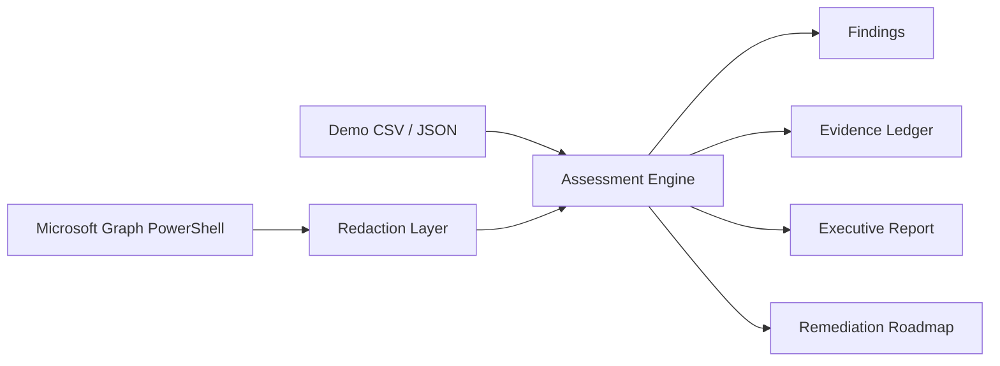

# Architecture

## Design Choices

- Demo mode is safe for public GitHub.
- Tenant mode is read-oriented and must be run only with authorized access.
- Redaction happens before tenant-mode output files are written.
- Reports are Markdown so they are easy to inspect, diff, and sanitize.
- Evidence is CSV so it can be imported into Excel, Power BI, SIEM tooling, or compliance trackers.

## Data Flow

1. `Invoke-IAMAssessment.ps1` loads demo data or calls Graph collection helpers.
2. Tenant-mode records pass through `ConvertTo-RedactedIAMData.ps1`.
3. Scoring functions calculate identity risk, SSO coverage issues, privileged access warnings, and MTTE friction.
4. Markdown and CSV reports are written under the selected output path.
